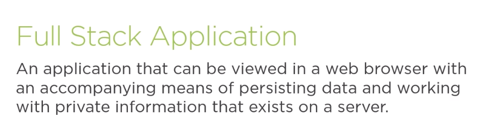

# Building a Full Stack App with React and Express

> https://app.pluralsight.com/library/courses/react-express-full-stack-app-building/table-of-contents

## Structure of Full Stack Applications

### Why Businesses need full stack applications

- Users expect a fast, fluid experience (dedicated fron end component)
- User-created content must still be there next time (data persistence)
- Processing payments and managing user data are critical to generating revenue



### Front End (Also called the "client")

- Comprises pages, buttons and forms for the user to interact with
- Concerned with user experience design, polish, speed, etc.
- Can change appearance for different devices ("reactivity")
- Consistently made up of JavaScript, HTML and CSS

### Client Limitations (Why do we need a back end?)

- Client can't persist data reliably
- Not possible to hide secrets on client
- No control over end user's hardware (may be too slow to handle necessary calculations)

### Back End (Also called the "server")

- Persists user experience by storing data permanently in databases
- Conceals information (such as secret keys, other user's data) from end user
- Communicates with third-party APIs, i.e. payment processors

### Server Limitations (Why do we need a front end?)

- Applications without client are difficult to use without technical knowledge (i.e. BASH commands, SQL queries)
- Wweb browsers allow for images, animation and styling, creating a favorable impression of your organization 

### What comprises a Back End?

- Database

> Provides a place for data to go. When databases do their job, they are very boring and predictable

- Server

> Provides a place to sore secret business logic or authorization, and to communicate with the database 

### Advantages of JavaScript-based Back End vs. Other Languages

- Developers can be hired flexibly
- Constants and formulas may be shared directly between front and back end
- Server can more easily pre-render pages or assist with calculations

### Limitations of using a JavaScript Back End

- Sluggish processing, greatly limited and slow math capabilities (no integer math, only floating-point)
- Some languages have a larger selection of certain libraries (i.e., data science and Python)
- Typically more challenging and expensive to deploy than Java, PHP, etc.

### Client-Server Workflow


## Configuring the Development Environment with Webpack and Babel

### Webpack

- Uses *babel* used to convert *.jsx* and ES6 files into *.js* files
- Bundles set of files connected by *import* statements into one file
- Uses *webpack-dev-server* plugin to create convenient environment

```bash
npm init -y
```

```bash
npm install --save-dev webpack webpack-cli webpack-dev-server
```

```bash
npm install --save-dev @babel/core @babel/node @babel/preset-env @babel/preset-react @babel/register babel-loader
```

> .babelrc

```json
{
  "presets": [
    ["@babel/preset-env", {
      "targets": {
        "node": "current"
      }
    }],
    "@babel/preset-react"
  ]
}
```

> webpack.config.js

```js
const path = require('path');

module.exports = {
  mode: "development",
  entry: path.resolve(__dirname, 'src', 'app'),
  output: {
    path: path.resolve(__dirname, 'dist'),
    filename: "bundle.js",
    publicPath: "/"
  },
  resolve: {
    extensions: ['.js', '.jsx']
  },
  devServer: {
    historyApiFallback: true
  },
  module: {
    rules: [{
      test: /\.jsx?/,
      loader: "babel-loader"
    }]
  }
}
```