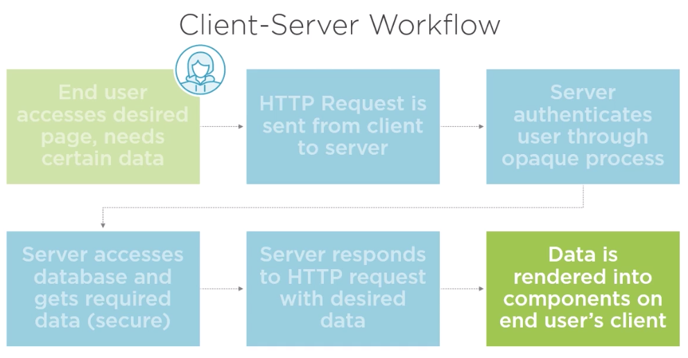

# Building a Full Stack App with React and Express

> https://app.pluralsight.com/library/courses/react-express-full-stack-app-building/table-of-contents

## Structure of Full Stack Applications

### Why Businesses need full stack applications

- Users expect a fast, fluid experience (dedicated fron end component)
- User-created content must still be there next time (data persistence)
- Processing payments and managing user data are critical to generating revenue


### Front End (Also called the "client")

- Comprises pages, buttons and forms for the user to interact with
- Concerned with user experience design, polish, speed, etc.
- Can change appearance for different devices ("reactivity")
- Consistently made up of JavaScript, HTML and CSS

### Client Limitations (Why do we need a back end?)

- Client can't persist data reliably
- Not possible to hide secrets on client
- No control over end user's hardware (may be too slow to handle necessary calculations)

### Back End (Also called the "server")

- Persists user experience by storing data permanently in databases
- Conceals information (such as secret keys, other user's data) from end user
- Communicates with third-party APIs, i.e. payment processors

### Server Limitations (Why do we need a front end?)

- Applications without client are difficult to use without technical knowledge (i.e. BASH commands, SQL queries)
- Wweb browsers allow for images, animation and styling, creating a favorable impression of your organization 

### What comprises a Back End?

- Database

> Provides a place for data to go. When databases do their job, they are very boring and predictable

- Server

> Provides a place to sore secret business logic or authorization, and to communicate with the database 

### Advantages of JavaScript-based Back End vs. Other Languages

- Developers can be hired flexibly
- Constants and formulas may be shared directly between front and back end
- Server can more easily pre-render pages or assist with calculations

### Limitations of using a JavaScript Back End

- Sluggish processing, greatly limited and slow math capabilities (no integer math, only floating-point)
- Some languages have a larger selection of certain libraries (i.e., data science and Python)
- Typically more challenging and expensive to deploy than Java, PHP, etc.

### Client-Server Workflow



## Configuring the Development Environment with Webpack and Babel

### Webpack

- Uses *babel* used to convert *.jsx* and ES6 files into *.js* files
- Bundles set of files connected by *import* statements into one file
- Uses *webpack-dev-server* plugin to create convenient environment

```bash
npm init -y
```

```bash
npm install --save-dev webpack webpack-cli webpack-dev-server
```

```bash
npm install --save-dev @babel/core @babel/node @babel/preset-env @babel/preset-react @babel/register babel-loader
```

> .babelrc

```json
{
  "presets": [
    ["@babel/preset-env", {
      "targets": {
        "node": "current"
      }
    }],
    "@babel/preset-react"
  ]
}
```

> webpack.config.js

```js
const path = require('path');

module.exports = {
  mode: "development",
  entry: path.resolve(__dirname, 'src', 'app'),
  output: {
    path: path.resolve(__dirname, 'dist'),
    filename: "bundle.js",
    publicPath: "/"
  },
  resolve: {
    extensions: ['.js', '.jsx']
  },
  devServer: {
    historyApiFallback: true
  },
  module: {
    rules: [{
      test: /\.jsx?/,
      loader: "babel-loader"
    }]
  }
}
```

## Implementing React Components and Redux State

### Overview of Redux

- Manages underlying data
- Application state can be easily accessed
- Changing application state occurs only via actions
- Redux state is provided to React components via React-Redux, a small connector library

### Create default application state as JSON file for development - Demo

> src/server/defaultServer.js

```js
export const defaultState = {
  users: [{
    id: "U1",
    name: "Dev"
  }, {
    id: "U2",
    name: "C. Eeyo"
  }],
  groups: [{
    name: "To Do",
    id: "G1",
    owner: "U1"
  }, {
    name: "Doing",
    id: "G2",
    owner: "U1"
  }, {
    name: "Done",
    id: "G3",
    owner: "U1"
  }],
  tasks: [{
    name: "Refactor tests",
    id: "T1",
    group: "G1",
    owner: "U1",
    isComplete: false,
  }, {
    name: "Meet with CTO",
    id: "T2",
    group: "G1",
    owner: "U1",
    isComplete: true,
  }, {
    name: "Compile ES6",
    id: "T3",
    group: "G2",
    owner: "U2",
    isComplete: false,
  }, {
    name: "Update component snapshots",
    id: "T4",
    group: "G2",
    owner: "U1",
    isComplete: true,
  }, {
    name: "Production optimizations",
    id: "T5",
    group: "G3",
    owner: "U1",
    isComplete: false,
  }],
  comments: [{
    owner: "U1",
    id: "C1",
    task: "T1",
    content: "Great work!"
  }]
} 
```

### Create basic Redux store to provide state to application as necessary - Demo

```bash
npm install --save redux@4.0.0
```

> src/app/store/index.js

```js
import { createStore } from 'redux';
import { defaultState } from '../../server/defaultState';

const reducer = (state = defaultState, action) => state;

export const store = createStore(
  reducer
)
```

> update: src/app/index.js

```js
console.log('hello world');

import { store } from './store';

console.log(store.getState());

```

### Adding a Dashboard Component - Demo

```bash
npm install --save react@16.5.0 react-dom@16.5.0 react-redux@5.0.7
```

> src/app/components/Dashboard.js

```js
import React from 'react';
import { connect } from 'react-redux';
import { ConnectedTaskList } from './TaskList';

export const Dashboard = ({ groups }) => (
  <div>
    <h1>Dashboard</h1>
    {
      groups.map(group => (
        <ConnectedTaskList id={group.id} name={group.name} />
      ))
    }
  </div>
);

const mapStateToProps = state => {
  return {
    groups: state.groups
  }
}

export const ConnectedDashboard = connect(mapStateToProps)(Dashboard);
```

> src/app/components/Main.js

```js
import React  from 'react';
import { Provider } from 'react-redux';
import { store } from '../store';
import { ConnectedDashboard } from './Dashboard';

export const Main = () => (
  <Provider store={store}>
    <div>
      <ConnectedDashboard />
    </div>
  </Provider>
)
```

> src/app/components/TaskList.js

```js
import React from 'react';
import { connect } from 'react-redux';

export const TaskList = ({ tasks, name }) => (
  <div>
    <h3>
      { name }
    </h3>
    <div>
      {
        tasks.map(task => (
          <div>{ task.name }</div>
        ))
      }
    </div>
  </div>
)

const mapStateToProps = (state, ownProps) => {
  let groupID = ownProps.id;
  return {
    name: ownProps.name,
    id: groupID,
    tasks: state.tasks.filter(task => task.group === groupID)
  }
}

export const ConnectedTaskList = connect(mapStateToProps)(TaskList);
```

### Routing and Navigation

- "Routing" is a term for when the form of the application is affected by the URL bar
- ```react-router```determines which React component to display based on URL
- Good use of routing allows a lot of information to be codified in URL

### Routing and Navigation - Demo

> npm install --save react-router-dom

> npm install --save history

> src/app/components/Navigation.js

```js
import { connect } from 'react-redux';
import { Link } from 'react-router-dom';
import React from 'react';

 const Nagivation = () => (
   <div>
     <Link to='/dashboard'>
        <h1>My Application</h1>
     </Link>
   </div>
 )

 const mapStateToProps = state => {
   return state;
 }

 export const ConnectedNavigation = connect(mapStateToProps)(Nagivation);
```

> src/app/store/history.js

```js
import { createBrowserHistory } from 'history';

export const history = createBrowserHistory();
```

> update: src/app/components/Main.js

```js
import React  from 'react';
import { Provider } from 'react-redux';
import { store } from '../store';
import { ConnectedDashboard } from './Dashboard';
import { Router, Route } from 'react-router-dom';
import { history } from '../store/history';
import { ConnectedNavigation } from './Navigation';

export const Main = () => (
  <Router history={ history }>
    <Provider store={store}>
      <div>
        <ConnectedNavigation />
        <Route exact path='/dashboard' render={
          () => (<ConnectedDashboard />)
        }>

        </Route>
      </div>
    </Provider>
  </Router>
)
```

### Adding new tasks

- Reducer must bet updated to allow tasks array to be changed
- Tasks need random ID, reducers can't be random, therefore Saga or Thunk is needed
- Updated state is reflected automatically in React component appearance

#### Sagas in brief

- Sagas run in the background of Redux applications
- Respond to actions by generating "side-effects" (anything outside the app)
- One of only a few places where generator functions are found

#### Generators in brief

- Standard JavaScript functions (non-generator) return a single value, instantly
- Generators can return any number of values, not just one
- Generator values can be returned at a later time (asynchronously)

### Adding new tasks - Demo

> npm install --save redux-logger redux-saga

> npm install --save uuid

Files with changes or created:

> src/app/components/Dashboard.js

> src/app/components/TaskList.js

> src/app/store/index.js

> src/app/store/mutations.js

> src/app/store/sagas.mock.js

### Implementing Task Details Route part 1: Displaying data


#### Using mock files during development

- Files with .mock extension indicate the files does not contain the true business logic
- Used to reduce complexity (e.g., does not depend on server)
- Mocks are commonly used in testing frameworks such a Jest
 
> src/app/components/TaskDetail.js

> update: src/app/components/Main.js

> update: src/app/components/TaskList.js

```js
import React from 'react';
import { connect } from 'react-redux';
import { Link } from 'react-router-dom';

const TaskDetail = ({
  id,
  comments,
  task,
  groups,
  isComplete
}) => (
  <div>
    <div>
      <input value={task.name} />
    </div>

    <div>
      <button>Complete / Reopen Task</button>
    </div>

    <div>
      <select>
        {groups.map(group => {
          return (<option key={group.id} value={group.id}>{group.name}</option>)
        })}
      </select>
    </div>

    <div>
      <Link to='/dashboard'>
        <button>Done</button>
      </Link>
    </div>
  </div>
)

const mapStateToProps = (state, ownProps) => {
  let id = ownProps.match.params.id;
  let task = state.tasks.find(task => task.id === id);
  let groups = state.groups;

  return {
    id,
    task,
    groups,
    isComplete: task.isComplete
  }
};

export const ConnectedTaskDetail = connect(mapStateToProps)(TaskDetail);
```

### Implementing Task Details Route part 2: Mutating data

> update: src/app/components/TaskDetail.js

> update: src/app/store/mutations.js

> update: src/app/store/index.js

## Creating Persistent Data Storage with Node, Express and MongoDB

### What is MongoDB?

- Database for storing persistent data
- Non-relational (collections, nor tables, fluid data structure)
- Convenint JSON-based communication works with Node
- Alternative to relational databases such as MySQL

**Download and Run MongoDB**

> https://www.robinwieruch.de/mongodb-macos-setup/

### Initializing the Database

**Download Robo 3T**

> https://robomongo.org/

After that we create a new connection with default values.

> npm install --save-dev mongodb@3.1.10

> src/app/server/connect-db.js

```js
import { MongoClient } from 'mongodb'; 
const url = 'mongodb://localhost:27017/myorganizer';
let db = null; 

export const connectDB = async () => {
  if (db) return db;
  let client = await MongoClient.connect(url, { useNewUrlParser: true });
  db = client.db();
  console.info("Got Db,", db);
  return db;
}
```

> src/app/server/initialize-db.js

```js
import { defaultState } from './defaultState';
import { connectDB } from './connect-db';

const initializeDB = async () => {
  let db = await connectDB();
  for (let collectionName in defaultState) {
    let collection = db.collection(collectionName);
    await collection.insertMany(defaultState[collectionName]);
  }
}

initializeDB();
```

> update: package.json

```
"scripts": {
   ....
    "initialize": "babel-node src/server/initialize-db"
  },
```

### Creating a Server

#### Why do we need a server?

- Confidential logic muts be hidden from end user
- Provides consistent way of working with database
- Useful for serving HTML and JS files of finished application

#### What is Express?

- NPM library which warps existing http toolset
- Process of creating a new server and "listening" to specific port
- Functional way of describing responses to HTTP requests from application

### Creating a server and updating tasks - part 1

> npm install --save-dev express

> npm install --save-dev cors

> npm install --save-dev body-parser

> src/server/server.js

```js
import express from 'express';
import cors from 'cors';
import bodyParser from 'body-parser';
import { connectDB } from './connect-db';

let port = 3000;
let app = express();

app.listen(port, console.log('Server listening on port', port));

// app.get('/', (req, res) => {
//   res.send('Hello World');
// });

app.use(
  cors(),
  bodyParser.urlencoded({extended: true}),
  bodyParser.json()
);

export const addNewTask = async task => {
  let db = await connectDB();
  let collection = db.collection('tasks');
  await collection.insertOne(task);
};

app.post('/task/new', async (req, res) => {
  let task = req.body.task;
  await addNewTask(task);
  res.status(200).send(); 
});
```

> src/server.spec.js

```js
import { addNewTask } from "./server";

addNewTask({
  name: "My task",
  id: "12345"
});
```

> uptade: package.json

```
"scripts": {
  ....
  "server": "babel-node src/server/server",
  "server-test": "babel-node src/server/server.spec"
  },
```

### Creating a server and updating tasks - part 2

> src/server/server.js

```js
import express from 'express';
import cors from 'cors';
import bodyParser from 'body-parser';
import { connectDB } from './connect-db';

let port = 3000;
let app = express();

app.listen(port, console.log('Server listening on port', port));

// app.get('/', (req, res) => {
//   res.send('Hello World');
// });

app.use(
  cors(),
  bodyParser.urlencoded({extended: true}),
  bodyParser.json()
);

export const addNewTask = async task => {
  let db = await connectDB();
  let collection = db.collection('tasks');
  await collection.insertOne(task);
};

export const updateTask = async task => {
  let { id, group, isComplete, name } = task;
  let db = await connectDB();
  let collection = db.collection('tasks');

  if(group) {
    await collection.updateOne({id}, {$set: {group}});
  }

  if(name) {
    await collection.updateOne({id}, {$set: {name}});
  }

  if(isComplete !== undefined) {
    await collection.updateOne({id}, {$set: {isComplete}});
  }
}

app.post('/task/new', async (req, res) => {
  let task = req.body.task;
  await addNewTask(task);
  res.status(200).send(); 
});

app.post('/task/update', async (req, res) => {
  let task = req.body.task;
  await updateTask(task);
  res.status(200).send(); 
});
```

> src/server/server.spec.js

```js
import { addNewTask, updateTask } from "./server";

const myFunc = async () => {
  await addNewTask({
    name: "My task",
    id: "12345"
  });

  await updateTask({
    name: "My task - updated",
    id: "12345"
  })

myFunc();
```